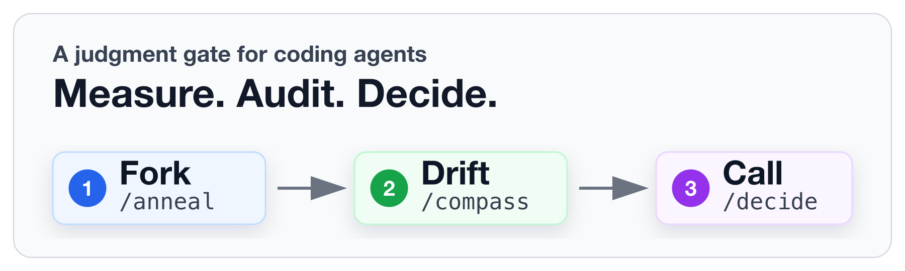
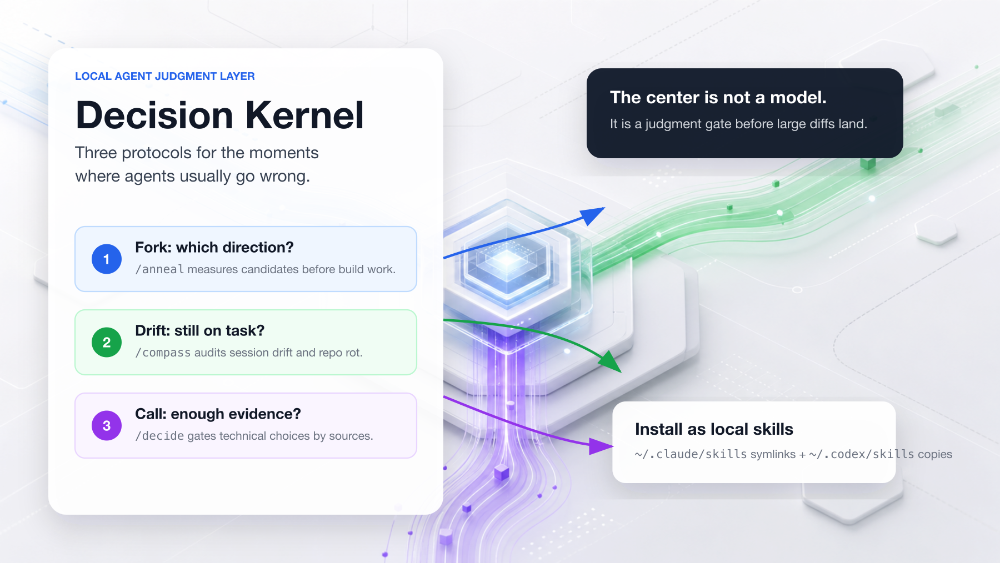
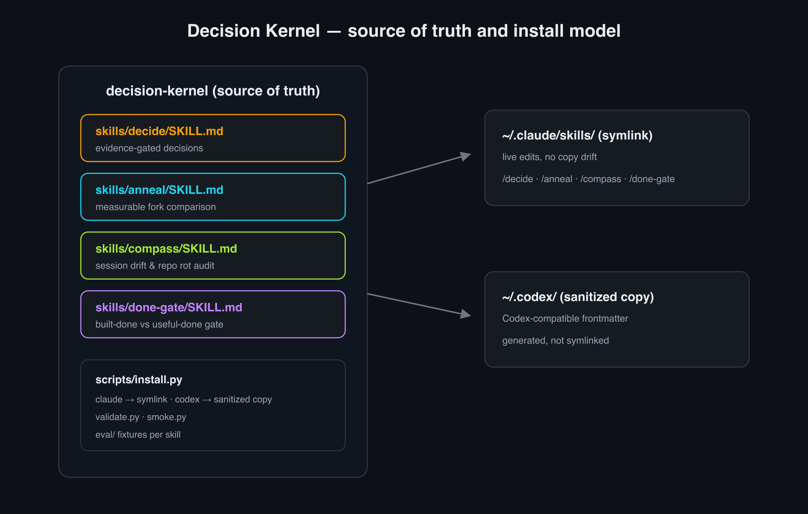

<div align="center">

# Decision Kernel

**A judgment gate for coding agents.**

Decision Kernel is three local Claude/Codex skills that make agent decisions
inspectable before large diffs land.



</div>

## Why This Exists

Agents fail most often at judgment boundaries: committing to the wrong direction,
continuing after drift, or deciding from weak evidence. Decision Kernel gives
those moments a short local protocol:

1. **Measure the fork** before building the wrong thing.
2. **Audit drift and rot** before a long session compounds mistakes.
3. **Decide with evidence** instead of confident guesswork.

This repository packages those protocols as local Claude/Codex skills. It does
not replace engineering judgment; it makes that judgment inspectable.

| Moment | Skill | Product Job |
| --- | --- | --- |
| "Which direction should we build?" | [`anneal`](skills/anneal) | Turn alternatives into a cheap measurable comparison. |
| "Has this session gone off-track?" | [`compass`](skills/compass) | Check drift, accumulated work, stale evidence, and codebase rot. |
| "What is the right technical choice?" | [`decide`](skills/decide) | Combine local project context with current source-backed evidence. |

## Example Workflow

A coding agent is about to build an inventory dashboard and must pick between a
table, graph, or card layout.

```text
/anneal choose the primary UI direction for a developer inventory dashboard:
table vs graph vs cards
```

The protocol forces the agent to define a task-based fitness sheet before
building: time to find an owner, steps to spot risky inventory, and coverage of
relationship questions. If the rough table scores highest, the agent builds the
table first instead of spending the session polishing a graph that fails the
actual task.

Later in the same session:

```text
/compass harden local Claude/Codex skills
/decide should this stale spec file be deleted?
```

`compass` checks whether the work still matches the session intent. `decide`
requires local repo context plus current sources before making the deletion call.

## Visual Model



## The Three Protocols

### `anneal` - Measure Before You Commit

Use when the agent is about to choose between competing approaches. `anneal`
forces the choice into a measurable fitness sheet, scores rough candidates, and
stops before expensive implementation.

Best for:

- UI direction choices
- architecture alternatives
- data model tradeoffs
- "graph vs table vs cards" style forks

### `compass` - Audit Drift And Rot

Use during long sessions when the agent may be optimizing for the wrong task or
carrying too much unverified work. `compass` compares the current work against a
baseline intent and checks local repo health signals.

Best for:

- long agent sessions
- repo cleanup before continuing
- catching stale test/lint assumptions
- identifying drift between requested work and current edits

### `decide` - Evidence-Gated Technical Decisions

Use when the agent must make or escalate a technical decision. `decide` starts
with local repo context, then requires credible current evidence before calling
anything a clear standard.

Best for:

- library/framework choices
- migration decisions
- deletion or deprecation calls
- contested engineering practices

## Install

Clone the repo:

```bash
git clone https://github.com/moonweave/decision-kernel.git
cd decision-kernel
```

Preview Claude Code install:

```bash
python3 scripts/install.py --target claude
```

Apply Claude Code install:

```bash
python3 scripts/install.py --target claude --apply
```

Preview Codex install:

```bash
python3 scripts/install.py --target codex
```

Apply Codex install:

```bash
python3 scripts/install.py --target codex --apply
```

Preview both:

```bash
python3 scripts/install.py --target all
```

Apply both:

```bash
python3 scripts/install.py --target all --apply
```

Without `--apply`, the installer only prints the planned changes. Claude installs
are symlinks to this repository. Codex installs are generated copies with
Codex-compatible frontmatter.

## Validate

Run local structural checks:

```bash
python3 scripts/validate.py
```

Run local smoke checks:

```bash
python3 scripts/smoke.py --local-only
```

Run installer behavior tests:

```bash
python3 -m unittest tests/test_install.py -v
```

Attempt live Claude Code smoke checks:

```bash
python3 scripts/smoke.py
```

If Claude Code is blocked by account or organization policy, live smoke returns
exit code `2` and prints the blocker. Local validation still verifies the repo
structure and installable skill files.

## Repository Layout



```text
skills/
  anneal/      # measurable fork comparison
  compass/     # session drift and repo rot audit
  decide/      # evidence-gated technical decisions
scripts/
  install.py   # Claude symlink install + Codex sanitized copy install
  smoke.py     # local and live smoke checks
  validate.py  # frontmatter, marker, and hygiene validation
tests/smoke/
  anneal.md
  compass.md
  decide.md
docs/
  architecture.md
  product-brief.md
  skill-catalog.md
```

## Status

Decision Kernel is currently a local-first toolkit for Claude Code and Codex
users. The core protocols are usable, but the public-facing product surface is
still early:

- no hosted UI
- no marketplace package
- no automated release channel
- live Claude Code smoke depends on the local account policy

The source of truth is this monorepo. Older standalone skill repos are legacy
mirrors and should not receive new development.

## Development

Edit skills only inside this repository:

```text
skills/anneal/SKILL.md
skills/compass/SKILL.md
skills/decide/SKILL.md
```

Before committing:

```bash
python3 scripts/validate.py
python3 scripts/smoke.py --local-only
```

Then reinstall locally:

```bash
python3 scripts/install.py --target all --apply
```

See [docs/architecture.md](docs/architecture.md) for the source-of-truth and
install model. See [docs/product-brief.md](docs/product-brief.md) for the PRD
framing behind the public positioning.
