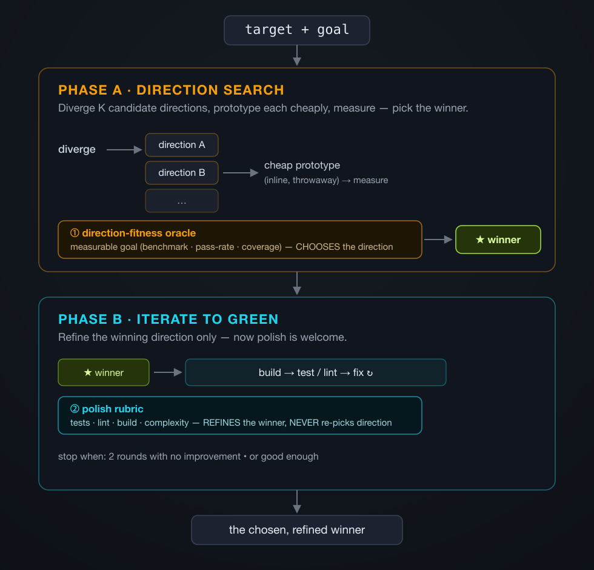

<p align="center">
  
</p>

# anneal

> A **measure-first decision discipline** for Claude Code. At a fork, sketch a few approaches, let a *cheap measurement* pick the winner — before you build deep in the wrong one. A checklist you run inline, not an engine you launch.

[](LICENSE)


```
/anneal        # at a decision fork: operationalize a measurable goal, sketch 2-3 directions,
               # cheaply measure each, pick the winner by the number — then refine it
```

---

## The problem it targets

The expensive mistake in agentic coding isn't bad execution — it's building deep in the direction your *intuition* picked, then discovering a quick measurement would have flagged it wrong. The first instinct (the obvious algorithm, the graph view, the cache) gets refined into a polished local optimum while a measurably-better direction never gets a fair look.

## What anneal is

A lightweight discipline you run **inline, in one pass** — no multi-agent fleet, no git worktrees, no engine:

1. **Operationalize** the goal into a few measurable questions.
2. **Sketch** 2–3 genuinely distinct directions.
3. **Prototype each cheaply and measure it** against those questions — record the actual numbers.
4. **Pick by the numbers, reading them yourself** — not by taste, not by which "feels" best.
5. **Refine the winner** with the polish rubric. Now polish is welcome; the direction is settled.

That's it. It's the disciplined version of *"sketch a few approaches, measure each, pick by the number"* — packaged so the rules are hard to forget.

## Why measurement matters

The value is not just replacing "I like this one" with a score. A good
direction-fitness table turns an abstract goal into an **improvement surface**:
which questions are already solved, which are still weak, and what to improve
next.

For a UI, that means replacing "the table feels better" with "the table wins
overall, but tool fan-in is only `1 / 2`, so add a tool filter or shared-tool
highlight." For a backend, it means replacing "this architecture seems cleaner"
with "latency improved, memory regressed, and the next move is reducing peak
RSS." The number is useful because it points at the next concrete change.

## The two oracles — the rule it exists to enforce

| Oracle | Question | When |
|---|---|---|
| **Direction-fitness** | *Which direction is better?* — measurable / task-based (benchmark, pass-rate, coverage, "clicks to find X") | picks the direction |
| **Polish rubric** | *How well is this one executed?* — tests, lint, build, complexity | refines the chosen winner |

**Polish must never pick — or eliminate — a direction.** A polished incumbent out-scores a rough challenger on polish every time; letting it choose direction is exactly the local-optimum trap. And the corollary, learned the hard way: **a *fixable* hygiene issue must not knock out the substantively-best candidate** — remediate it and then compare, never let an eligibility gate hand the win to a worse-but-cleaner option.

## How it works

<p align="center">
  
</p>

## When to use it — and when to skip

- **Skip it when the direction is obvious** (an O(n) hash-set plainly beats an O(n²) loop). Measuring the obvious is pure overhead — just build it.
- **Use it when your intuition might be wrong** — competing approaches where only a measurement can say which wins: cache vs. better algorithm vs. precompute; table vs. graph; index vs. denormalize. The real address is the narrow intersection of **measurable signal ∩ non-obvious direction**.

## Quick start

Install as a user skill — just the protocol and its rubrics:

```bash
mkdir -p ~/.claude/skills/anneal
cp -R SKILL.md rubrics ~/.claude/skills/anneal/
```

It auto-loads in any new Claude Code session; verify it appears in `/help`. Then type `/anneal` when you hit a non-obvious build/approach decision.

## Honest positioning

**The idea isn't new — and anneal doesn't pretend otherwise.** "Generate candidates, score each by an objective signal, keep the best, refine it" is established practice: best-of-N with execution-based selection, [AlphaCodium](https://arxiv.org/abs/2401.08500) (diverge → rank by tests → iterate the winner), evolutionary program search where an automatic evaluator picks rather than the model's taste ([AlphaEvolve](https://deepmind.google/blog/alphaevolve-a-gemini-powered-coding-agent-for-designing-advanced-algorithms/)). LLMs are also [biased toward their own outputs](https://arxiv.org/abs/2404.13076), which is exactly why "measure, don't self-judge" matters.

**So anneal is deliberately a discipline, not a framework.** An earlier version of this skill was a heavyweight multi-agent + git-worktree engine; testing showed it cost roughly an order of magnitude more tokens, added failure modes, and — in the one decision it was examined on — its automatic eligibility gate picked the *wrong* winner (eliminating the best candidate on fixable hygiene), which a human had to override. The value was never in the orchestration; it was in the measurement habit and the two-oracle rule. So that's all this skill now is: the rules, applied cheaply and early, by you.

## Honest limits

- **It is decision-support, not autonomy.** You read the scores and pick. Its value is forcing *measurement over intuition*, cheaply — not removing you from the loop.
- **No measurable signal ⇒ no real ranking.** For pure-taste targets where even operationalized questions yield no signal, anneal can only lay out options for you to choose; it will not discover the "best" direction, and it must not fake one on polish.
- **It is a discipline, not a moat.** It encodes a known-good habit so you don't forget it — that's the whole claim. Used where the direction is already obvious, it's just overhead.

## A worked example — measurement vs. intuition

The fork the discipline is *for* ships, inspectable, in [`eval/non-obvious-fork/`](eval/non-obvious-fork/): the task, the dataset, the *derived* questions (`derivation.md`), the scorecard, and **both** the no-skill baseline and the anneal result — so you can audit the claim instead of taking it on faith.

The fork: choose a UI direction for a developer-config inventory dashboard showing relationships between skills, tools, roles, scopes, and risk.

- **Intuition says "graph."** "Relationships" suggests a node-link graph; that's the tempting build.
- **Operationalizing refutes it.** Turning the goal into five one-view *scanning* questions (find an orphan, spot the riskiest item, trace precedence, see scope, identify a cross-tool single point of failure — see `derivation.md`) and scoring each candidate shows a **refined table** answers them at least as well, because the data is mostly tree-shaped (one owner per item). The derivation, not taste, exposes that.

**Honest scope of the claim:** in this case a no-anneal control *also* picked the table. So the value here is **not** "anneal found a winner a capable agent would miss" — it is that the choice becomes an **auditable, repeatable decision record** (derivation + scorecard), made *before* expensive build effort, instead of free-form reasoning.

The `fixable-DQ` corollary (§2 — never let an eligibility gate eliminate the substantively-best candidate over a couple of routine hygiene issues; remediate, then judge) comes from a separate *private* run where exactly that gate error happened and had to be hand-corrected. That run isn't shippable here, so treat it as the rule's origin story, not as a result you can reproduce.

## Baseline comparison

The non-obvious-fork fixture packages that run into an auditable case:
[`eval/non-obvious-fork/`](eval/non-obvious-fork/). In a fresh no-anneal control,
Claude also picked the table, so this fixture should not be oversold as proof
that anneal uniquely discovers the winner. Its current value is showing what
anneal adds when the final answer is the same: explicit fitness questions,
direction scores, rejected-direction accounting, and a clean separation between
direction choice and polish.

Same task: choose a UI direction for showing relationships between skills,
tools, roles, scopes, overrides, and risk.

### Without anneal

A capable first pass can still pick the refined table from the fixture.

Result:

- picks refined table
- explains that owner, scope, risk, and overrides are mostly item attributes
- identifies shared tools as the only substantial cross-cutting relationship
- does not produce a formal direction-fitness table
- does not score rejected directions on the same task questions

### With /anneal

anneal first operationalizes the goal into five task questions, then scores each
direction before building deeply.

| Direction | Clean re-run | Original (`scorecard.md`) |
|---|---:|---:|
| Refined table | 9 | 10 |
| Grouped cards | 8 | 7 |
| Node-link graph | 7 | 6 |
| Matrix | 2 | 7 |

Two runs exist; they differ in exact totals but agree the table wins (the
direction is stable across runs, the precise numbers aren't). The committed
`scorecard.md` holds the **original** per-question breakdown; the table above
headlines the **clean re-run**; `observed-run-2026-05-30-clean.md` reconciles
them. Matrix is the one total that moved materially — a caveat, not a
winner-changer.

Result:

- picks refined table
- rejects graph with an explicit `7 / 10` score after giving it a
  graph-favorable tool fan-in question
- keeps polish separate from direction choice
- treats routine hygiene issues as fixable, not as direction disqualifiers

Takeaway: in this control run, anneal did not change the selected direction. It
changed the **decision artifact**: the result is auditable, repeatable, and much
harder to confuse with visual polish.

## Self-eval (the simple case)

`eval/dup-finder/` is a tiny worked example for the *steps*, not a benchmark: a naive O(n²) duplicate finder where the O(n) rewrite is provably far faster. `python3 eval/dup-finder/target.py` prints the baseline; `eval/dup-finder/expected.md` walks the discipline. It is deliberately a **known-answer** case (the O(n) direction is obvious) — useful to show the mechanics, but exactly the case where you'd *skip* anneal in practice. The real value lives in the non-obvious fork above.

## Status

Early, and honest about it. The two-oracle rule and the measure-first habit are the stable core. It is a discipline, not a measured win over just prompting a capable agent well — use it as a habit, not a guarantee.

**Why a skill and not just a tip?** Because the rules get *forgotten*. In the real run above, an automated gate violated the fixable-DQ rule and a human had to catch it — proof the rule isn't self-evident under pressure. Packaging it as an invocable checklist (`/anneal`) carrying concrete scoring rubrics makes it a forcing function at the fork, where a one-line reminder gets skipped. That, plus the narrow niche it serves (measurable signal ∩ non-obvious direction), is the whole justification — and it is a close call: if you'd reliably run these steps from memory, a one-paragraph habit-note would do just as well.

## License

MIT — see [LICENSE](LICENSE).

## Author

[@moonweave](https://github.com/moonweave)
